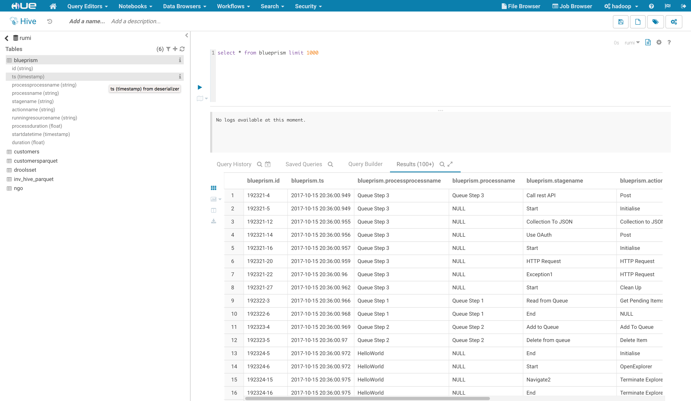
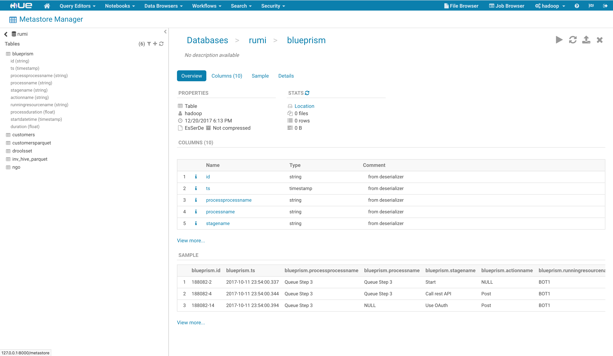
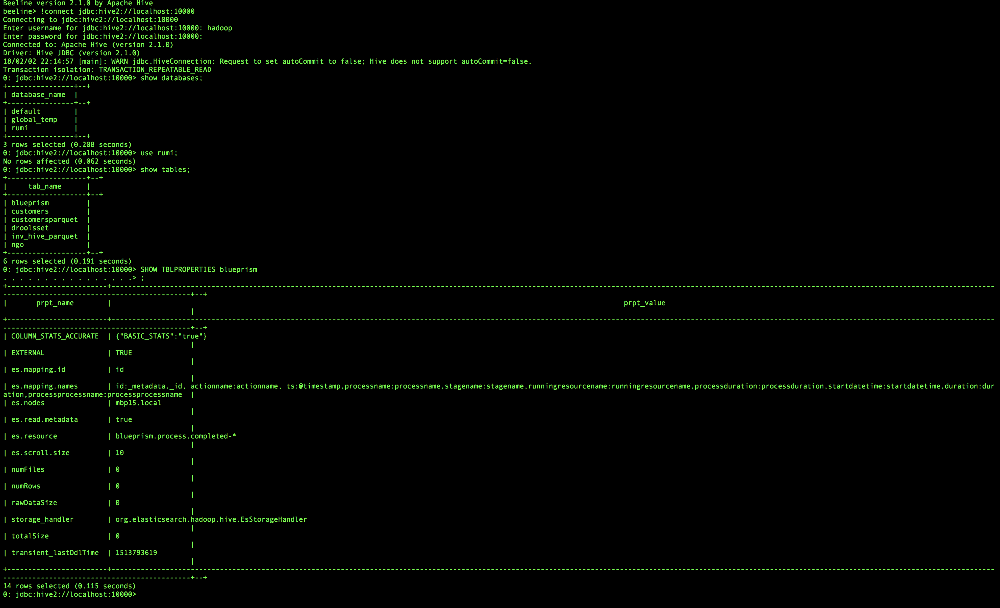
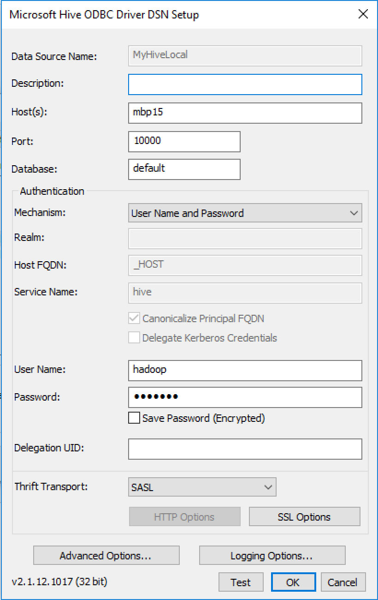
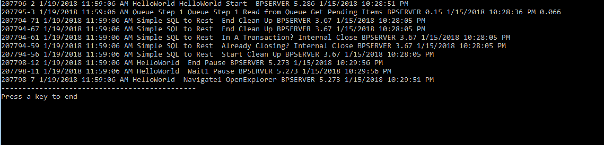

# BluePrism-Hadoop-Hive-Elastic
This project aims at testing and providing insight on how to integrate BluePrism with Hadoop and Elasticsearch Stack
As I am a fa experimenting, I like to install everything by myself, this is a way to get to understand thing under the hood. Here are the list of software installed in my sand box for this project :

**Installed on Linux**
 - Hadoop 2.7.3
  - Spark 2.2.1
 - Hive 2.1.0
 - Oozie 4.3.0 (optional)
 - Hue 3.12.0
 - Elastic 6.x, Kibana 6.x
 - Elastic Hadoop HDFS repository plugin

**Installed on Windows**

  - Microsoft® Hive ODBC Driver

# Testing Hadoop/Hive

First make sure you have everything you need in *hadoop*, I use *hue* tool s very friendly rather than the *hadoop* command shell. Furthermore as we are going to use hive as the proxy to get access to all data, it is important to visualize that everything works fine.

## Hue

Here under you have an example of a query `select * from blueprism limit 1000`. The table `blueprism` is a proxy to an elastic index called blueprism.



## Sample of proxy using Hive to access Elastic table from Hue



## Sample using shell beeline to get to hive.



# Configure ODBC

Be careful to chose what works with your application *ODBC 32 bit* or *64 bit*, here is the configuration that works for me. Here under the name of the machine where Hive is installed is *mbp15*, if you have an integration with Active Directory or LDAP it works even better.




# Testing C# first

```csharp
using System;
using System.Collections.Generic;
using System.Linq;
using System.Text;
using System.Threading.Tasks;
using System.Data.Odbc;
using System.Data.Common;

namespace HiveTest
{
    class Program
    {
        static void Main(string[] args)
        {
            GetData();
            Console.WriteLine("----------------------------------------------");
            Console.WriteLine("Press a key to end");
            Console.Read();
        }
        static async void GetData()
        {
            using (OdbcConnection conn =
                   new OdbcConnection("DSN=MyHiveLocal"))
            {
                object[] meta = new object[10];
                bool read;
                conn.Open();
                OdbcCommand cmd = conn.CreateCommand();

                OdbcCommand cmd2 = conn.CreateCommand();

                
                cmd.CommandText =
                    "select * from rumi.blueprism limit 10;";
                    //"select * from rumi.customers limit 10;";
                //"show databases;use rumi;show tables;select * from rumi.droolsset;";
                DbDataReader dr =  cmd.ExecuteReader();
                System.Data.DataTable tmpHiveTable = dr.GetSchemaTable();
                if (dr.Read() == true)
                {
                    do
                    {
                        int NumberOfColums = dr.GetValues(meta);

                        for (int i = 0; i < NumberOfColums; i++)
                            Console.Write("{0} ", meta[i].ToString());

                        Console.WriteLine();
                        read = dr.Read();
                    } while (read == true);
                }
                dr.Close();

            }
        }
    }
}


```

### Output




## BluePrism integration

Based on the test made in the previous section, we have now all the building blocks to crearte a VBO in BluePrism to access Hive. Leveraging the VBO created for other integration like SQL can accelerate the process. The real magic happens already with ODBC, you just need to use the connection string to hive `DSN=MyHiveLocal32` and the snippet of code from the previous `C#` example here above.

Dislaimer
======

> Note : the proposed VBO has implemented the bare minimum and is just here to illustrate the use case, this is not intended to be use on production by any mean. The skeleton is a resused of a standard published VBO from blueprism in order to keep the same structure. Up to the user to adpat it and make it production grade.

### Use Case : *Simple Hive to Rest*

To illustrate how blueprism can consume Hadoop/Hive data, we have built a sample that executes a query returning a number of rows and then publishes them to a rest interface. To ease the test, we have created two global environment variables as follow :


Here is the Process *Simple Hive to Rest*


There are two actions related to Hive : *Configure Hive* and *Get Collection From Hive*, this is where all the magic happens if any :relieved:


#### HIVE VBO : *Open*


#### HIVE VBO : *GetCollection*


#### The multipurpose javascript node.js Rest output

```js
[32m[2018-02-12 21:50:55.977] [INFO] JSHelloWorldMultiPurpose - Hello World app listening at http://localhost:3000
[2018-02-12 21:50:55.984] [TRACE] JSHelloWorldMultiPurpose - This platform is darwin - Architecture :  x64
[2018-02-12 21:50:55.985] [DEBUG] JSHelloWorldMultiPurpose - Environment : 
{
  "TMPDIR": "/var/folders/j9/4wqs8g_558l36ppwth2802940000gn/T/",
  "__CF_USER_TEXT_ENCODING": "0x1F5:0x0:0x52",
  "HOME": "/Users/rumi",
  "SHELL": "/bin/bash",
  "Apple_PubSub_Socket_Render": "/private/tmp/com.apple.launchd.yVrXpFmGMQ/Render",
  "SSH_AUTH_SOCK": "/private/tmp/com.apple.launchd.JvcZp442NO/Listeners",
  "PATH": "/usr/bin:/bin:/usr/sbin:/sbin",
  "LOGNAME": "rumi",
  "DISPLAY": "/private/tmp/com.apple.launchd.z60MFuhHiZ/org.macosforge.xquartz:0",
  "XPC_SERVICE_NAME": "org.eclipse.platform.ide.2740",
  "USER": "rumi",
  "XPC_FLAGS": "0x0",
  "JAVA_STARTED_ON_FIRST_THREAD_869": "1",
  "APP_ICON_869": "../Resources/Eclipse.icns"
}
[2018-02-12 22:08:29.990] [INFO] JSHelloWorldMultiPurpose - [1][::ffff:192.168.56.142=>]POST/count{}
[2018-02-12 22:08:29.991] [TRACE] JSHelloWorldMultiPurpose - [1][::ffff:192.168.56.142=>]POST/count : Request.body [ { id: '209608-2',
    processprocessname: 'HelloWorld No Delay',
    processname: 'HelloWorld No Delay',
    stagename: 'Start',
    actionname: '',
    processduration: 0.73,
    duration: 0 } ]
[2018-02-12 22:08:34.563] [INFO] JSHelloWorldMultiPurpose - [2][::ffff:192.168.56.142=>]POST/count{}
[2018-02-12 22:08:34.563] [TRACE] JSHelloWorldMultiPurpose - [2][::ffff:192.168.56.142=>]POST/count : Request.body [ { id: '209608-10',
    processprocessname: 'HelloWorld No Delay',
    processname: '',
    stagename: 'Start',
    actionname: 'Terminate Explorer',
    processduration: 0.73,
    duration: 0 } ]
[2018-02-12 22:08:39.003] [INFO] JSHelloWorldMultiPurpose - [3][::ffff:192.168.56.142=>]POST/count{}
[2018-02-12 22:08:39.004] [TRACE] JSHelloWorldMultiPurpose - [3][::ffff:192.168.56.142=>]POST/count : Request.body [ { id: '209618-6',
    processprocessname: 'HelloWorld',
    processname: '',
    stagename: 'Start',
    actionname: 'OpenExplorer',
    processduration: 5.29,
    duration: 0 } ]
[2018-02-12 22:08:43.533] [INFO] JSHelloWorldMultiPurpose - [4][::ffff:192.168.56.142=>]POST/count{}
[2018-02-12 22:08:43.534] [TRACE] JSHelloWorldMultiPurpose - [4][::ffff:192.168.56.142=>]POST/count : Request.body [ { id: '209618-19',
    processprocessname: 'HelloWorld',
    processname: '',
    stagename: 'End',
    actionname: 'Clean Up',
    processduration: 5.29,
    duration: 0 } ]
[2018-02-12 22:08:49.175] [INFO] JSHelloWorldMultiPurpose - [5][::ffff:192.168.56.142=>]POST/count{}
[2018-02-12 22:08:49.176] [TRACE] JSHelloWorldMultiPurpose - [5][::ffff:192.168.56.142=>]POST/count : Request.body [ { id: '209616-18',
    processprocessname: 'Simple SQL to Rest',
    processname: '',
    stagename: 'Open',
    actionname: 'Open',
    processduration: 24.504,
    duration: 0 } ]
[2018-02-12 22:08:53.724] [INFO] JSHelloWorldMultiPurpose - [6][::ffff:192.168.56.142=>]POST/count{}
[2018-02-12 22:08:53.724] [TRACE] JSHelloWorldMultiPurpose - [6][::ffff:192.168.56.142=>]POST/count : Request.body [ { id: '209616-30',
    processprocessname: 'Simple SQL to Rest',
    processname: '',
    stagename: 'End',
    actionname: 'Get Collection',
    processduration: 24.504,
    duration: 0 } ]
```


